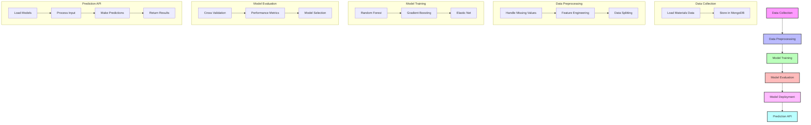

# Materials Science Machine Learning Pipeline

This project creates a data processing, analysis, and machine learning pipeline for materials science data. It includes scripts to load data into MongoDB, explore and visualize the data, train machine learning models, and provide an API for predictions.

## Prerequisites

- Python 3.8+
- MongoDB installed and running
- Data files in `data/data_json/` and `data/images/` directories

## Installation

1. Clone this repository:
```bash
git clone https://github.com/chirayupatel9/DSCI-592.git
cd DSCI-592
```

2. Install required dependencies:
```bash
pip install -r requirements.txt
```

3. Make sure MongoDB is running on your local machine.

## Usage

## **Download data from DataFed then do the needful**

### 1. Load data into MongoDB

This script loads JSON and image data into MongoDB:

```bash
python load_data_to_mongodb.py
```

### 2. Explore and visualize data

This script explores the data in MongoDB and creates visualizations:

```bash
python explore_data.py
```

### 3. Train machine learning models

This script trains models to predict band gap and formation energy:

```bash
python train_ml_models.py
```

### 4. Run the prediction API

This script starts a Flask API for material property predictions:

```bash
python predict_api.py
```

## API Endpoints

The API provides the following endpoints:

- `GET /` - API information
- `GET /materials/<material_id>` - Get material by ID
- `GET /search` - Search for materials with query parameters
- `POST /predict` - Predict properties for a material

Example prediction request:

```bash
curl -X POST http://localhost:5000/predict \
  -H "Content-Type: application/json" \
  -d '{"material_id": "mp-555976"}'
```

Or for new materials:

```bash
curl -X POST http://localhost:5000/predict \
  -H "Content-Type: application/json" \
  -d '{"formula": "Na2TiSiO5", "crystal_system": "Orthorhombic", "nsites": 36}'
```

## Project Structure

- `dbconfig.py` - MongoDB configuration
- `load_data_to_mongodb.py` - Script to load data into MongoDB
- `explore_data.py` - Data exploration and visualization
- `train_ml_models.py` - Machine learning model training
- `predict_api.py` - Flask API for predictions
- `data/` - Directory containing the dataset
  - `data_json/` - JSON data files
  - `images/` - Image files
- `plots/` - Generated visualizations
- `models/` - Trained machine learning models

## Features

- Stores material data and images in MongoDB
- Provides extensive data exploration and visualization
- Trains multiple machine learning models (Random Forest, Gradient Boosting, Elastic Net)
- Predicts material properties via a REST API
- Allows searching for materials by various criteria

## Workflow Diagram



This flowchart illustrates the complete workflow of the material property prediction system:
1. Data Collection: Initial data loading and storage in MongoDB
2. Data Preprocessing: Cleaning, feature engineering, and data splitting
3. Model Training: Training multiple ML models (Random Forest, Gradient Boosting, Elastic Net)
4. Model Evaluation: Cross-validation and performance assessment
5. Model Deployment: Saving and preparing models for production
6. Prediction API: REST API for making predictions and retrieving results