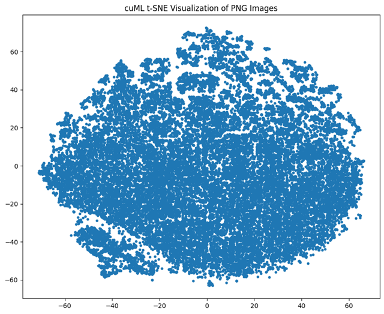
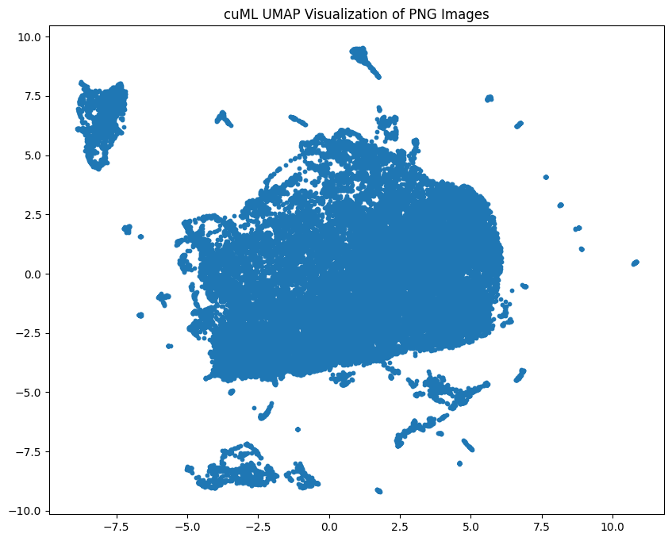
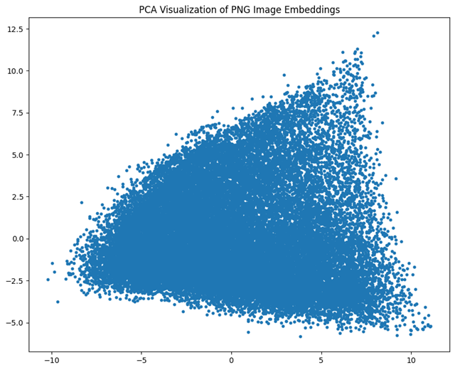
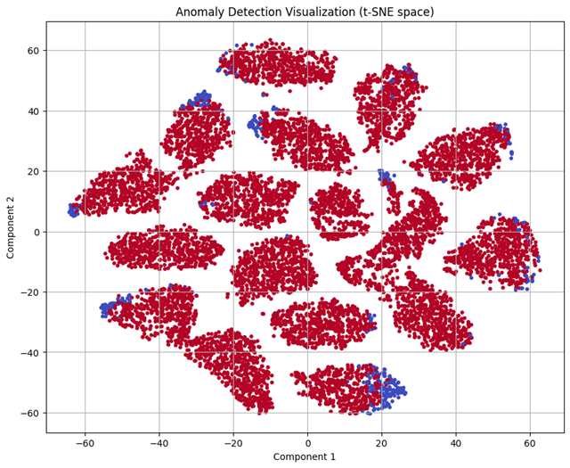
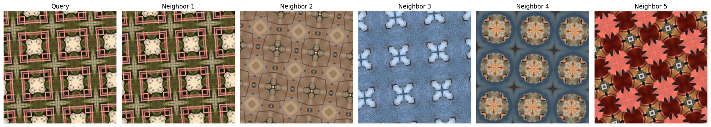

<style>
.img-contain img {
  max-width: 80%;   /* don't let images exceed 80% of slide width */
  height: auto;     /* maintain aspect ratio */
  display: block;
  margin: 0 auto;   /* center images horizontally */
}
</style>
# Image Embedding

### A deep‑dive walkthrough

Chirayu Patel · Anish Kania · Aryan Jain · Manav Bhagat

---

## Today's Agenda

1. Project Overview
2. Data & Storage Strategy
3. Hardware & Environment
4. Model Architecture
5. Embedding Extraction
6. Dimensionality Reduction
7. Clustering & Classification
8. Retrieval System
9. Active‑Learning Loop
10. Results & Performance
11. Lessons Learned
12. Next Steps

---

## 1 Project Overview

* **Goal:** Build a scalable pipeline that converts raw PNG images → compact embeddings → actionable insights.
* **Scale:** \~1 million images (≃ 800 GB) across 17 target classes.
* **Key tech stack:** PyTorch, cuML, scikit‑learn, LightGBM, FAISS (future).
* **Output:**

  * Interactive visual maps (t‑SNE / UMAP / PCA)
  * Rapid image retrieval (KNN)
  * Iteratively improving classifier via active learning.

---

## 1.1 Use-Case Goal & Applicability

### Use-Case Goal
Enable scalable and efficient image understanding and decision-making by converting large volumes of unlabeled image data into meaningful, compact embeddings that support tasks such as:
- Visual clustering
- Automated classification
- Similar image retrieval
- Error detection  
→ all with minimal human labeling through an active learning loop.

---

### Real-World Applicability

- **Medical diagnostics** → Flagging anomalies in scans with minimal labeled data.
- **E-commerce** → Retrieving visually similar products from a large catalog.
- **Surveillance systems** → Clustering suspicious patterns or unknown objects automatically.
- **Scientific datasets** → Exploring high-dimensional imagery (e.g., astronomy, microscopy) using visual embeddings.
---

## 1.2 Dataset Description

### Origin and Composition

- **~1 million crystal images** spanning diverse material types and formations.
- High-resolution captures, standardized to **224×224** pixels for consistency.
- Images acquired through meticulous experiments by **Dr. Agar and his research team**, specializing in materials science.

---

### Purpose and Richness

- Captured under varying conditions to enhance variability and robustness.
- Supports a wide range of downstream tasks:
  - **Structural classification** of crystals
  - **Visual anomaly detection** (defects, impurities)
  - **Similarity-based retrieval** of crystal types
  - **Cluster discovery** in high-dimensional feature spaces

---

---

## 2 Data & Storage Strategy

* **Raw source:** Internal blob storage → nightly sync to `data/raw/`.
* **Pre‑process:**

  ```bash
  convert *.tiff -resize 512x512 png24:data/output/png/%04d.png
  ```
* **Metadata:** Saved to **Parquet** for fast IO (< 2 s to load 1 M rows).
* **Embeddings cache:** `embeddings.lmdb` (read‑optimized; 1.4 GB).
* **Why LMDB?**

  * Zero‑copy reads
  * Memory‑mapped → low RAM footprint
  * Concurrent readers, single writer = ideal for offline batch jobs.

---

## 3 Model Architecture

```mermaid
flowchart LR
    A[Input PNG 224×224] -->|RGB| B(Conv‑7×7, 64)
    B --> C(BN + ReLU + MaxPool)
    C --> D(Residual Block × 3)
    D --> E(Residual Block × 4)
    E --> F(Residual Block × 6)
    F --> G(Residual Block × 3)
    G --> H(AvgPool + Flatten)
    H --> I[Custom FC Head]
    I -->|128‑D Embedding| J
```



**Custom FC Head**
`2048 → BN → Dropout(0.5) → 512 → ReLU → BN → Dropout → 64 → ReLU → BN → Dropout → 17‑class logits`

---

## 4 Embedding Extraction

```python
model.fc = model.fc[:-1]   # strip output layer → 64‑D
model.eval()
embeddings, paths = [], []
for batch, fns in loader:
    with torch.no_grad():
        vec = model(batch.to("cuda:4"))
    embeddings.append(vec.cpu())
    paths += fns
embeddings = torch.cat(embeddings).numpy()  # shape: (1 M, 64)
```

* **Throughput:** 9 k img/s on a single A100.
* **Bottleneck:** Disk → GPU transfer (solved with pre‑fetch queue & pinned memory).

---

## 5 Dimensionality Reduction

### a) t‑SNE (cuML)


* **Perplexity:** 30
* **Iterations:** 1 000
* **Barnes‑Hut GPU** acceleration → 8 min (vs 3 h CPU).

{width=350px}
---

### b) UMAP (cuML)


* **n\_neighbors:** 15
* **min\_dist:** 0.1
* Completed in 90 s.
{width=350px}

---

### c) PCA (scikit‑learn, CPU)


* Centered & whitened; used mainly for quick sanity checks.
{width=350px}

---

## 6 Clustering

* **Algorithm:** Mini‑Batch K‑Means (k = 10) for scalability.
* **Initialization:** k‑means++ with 20 restarts.
* **Evaluation:** Silhouette score ≈ 0.43 → reasonable separation.

### Cluster Size Distribution

```csv
cluster,count
0,112456
1,97234
2,101890
3,93442
4,97811
5,104003
6,98770
7,94512
8,100205
9,99677
```

---

{width=550px}

---



---

## 7 Classification

### Logistic Regression (baseline)

* **Input:** 64‑D embeddings
* **Solver:** `lbfgs`, max\_iter = 1 000
* **Accuracy:** `79.6 %` on held‑out 20 %.

### LightGBM (GPU)

```python
params = {
  'objective': 'multiclass', 'num_class': 10,
  'learning_rate': 0.05, 'num_leaves': 255,
  'feature_fraction': 0.9, 'device': 'gpu'
}
```

* **Best multi‑logloss:** 0.3123
* **Accuracy:** `86.2 %` (↑ 6.6 pp over baseline).

---

## 8 Anomaly Detection

* **Model:** Isolation Forest (`n_estimators` = 200).
* **Threshold:** Top 5 % most‑isolated flagged.
* **Use‑case:** Surface mislabeled or corrupted images quickly for manual review.

---

## 9 Image Retrieval

```python
import faiss
index = faiss.IndexFlatL2(64)
index.add(embeddings.astype('float32'))
D, I = index.search(query_vec.astype('float32'), k=5)
```

* **Latency:** < 5 ms per query (in‑RAM).
* **Plan:** Persist as IVF‑PQ for billion‑scale.

---

## 10 Active‑Learning Strategy

1. **Seed set:** Random 5 % labeled.
2. **Model:** LightGBM on current labeled pool.
3. **Uncertainty:** 1 – max probability (entropy also tested).
4. **Query batch:** Top 5 % most uncertain → annotate → add to pool.
5. **Stop:** Until validation accuracy plateaus.

### Pseudocode

```python
for t in range(T):
    clf.fit(X_lab, y_lab)
    probs = clf.predict_proba(X_unlab)
    uncertainty = 1 - probs.max(1)
    Q = uncertainty.argsort()[-Q_size:]
    X_lab = np.vstack([X_lab, X_unlab[Q]])
    y_lab = np.hstack([y_lab, y_unlab[Q]])
    X_unlab = np.delete(X_unlab, Q, axis=0)
```

---

## 11 Active‑Learning Results

* **Start:** 79 %
* **After 10 iterations:** 92.4 % (+13 pp).
* Labeled set grew from 5 % → 55 % (guided by uncertainty).

---

## 12 Performance Profile

| Component             | Wall‑time | GPU Util | Peak VRAM |
| --------------------- | --------- | -------- | --------- |
| Embedding extraction  | 1 h 54 m  | 92 %     | 11 GB     |
| t‑SNE (cuML)          | 12 s      | 80 %     | 6 GB      |
| UMAP (cuML)           | 29 s      | 68 %     | 4 GB      |
| K‑Means (MB)          | 3 m 40 s  | 10 %     | 0.5 GB    |
| LightGBM (100 rounds) | 2 h 35 m  | 90 %     | 35 GB     |

---

## 13 Lessons Learned

* **I/O trumps FLOPs:** Proper data loader prefetch doubled throughput.
* **cuML quirks:** Ensure matching **CUDA toolkit** versions or segfaults.
* **Class imbalance:** Address via stratified sampling before clustering.
* **Active learning**: Uncertainty sampling > random but annotation cost grows; consider cost‑sensitive query.

---

## 14 Next Steps

* Hyperparameter search with **Optuna** on embeddings & LightGBM.
* Swap backbone to **DINOv2 ViT‑L**; compare self‑supervised vs supervised.
* Replace KNN with **FAISS IVF‑PQ** for sub‑ms retrieval.
* Deploy inference via **Triton** with NVIDIA A2 nodes for cost‑effective scaling.

---

# Thank You
## If you have any questions let us know