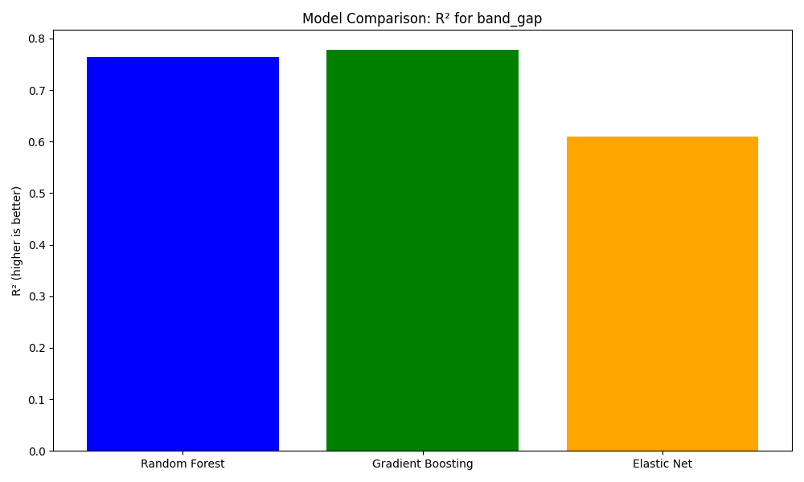
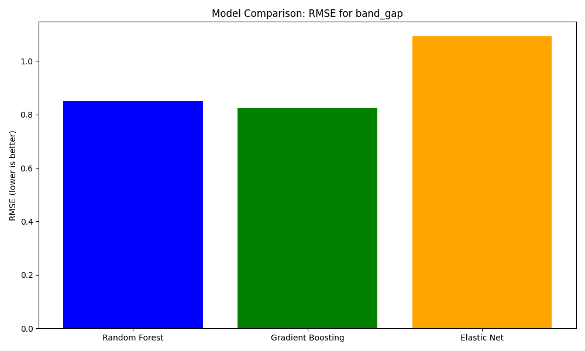
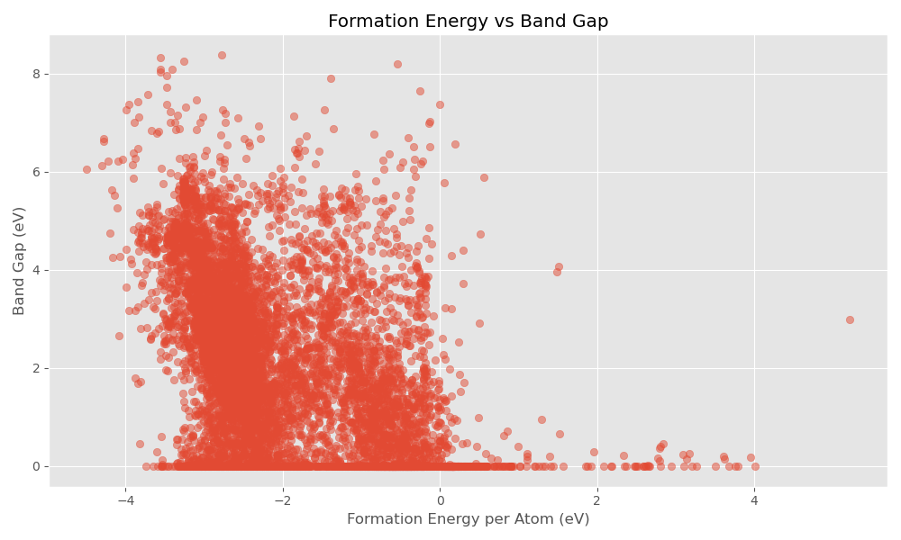
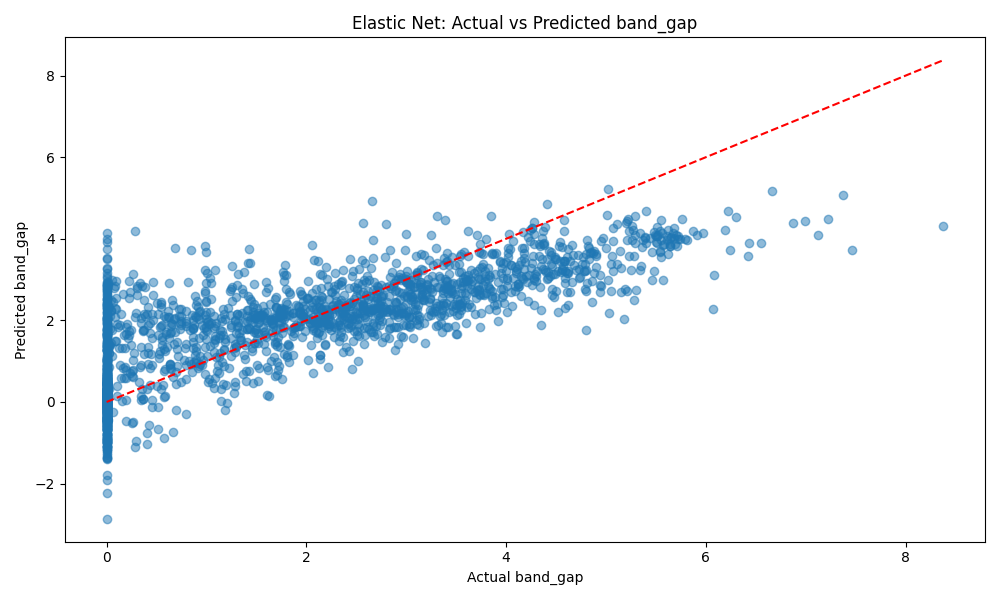

# Materials Science Machine Learning Pipeline

A comprehensive system for predicting material properties using machine learning

<div class="pt-12">
  <span class="px-2 py-1">
    Press <kbd>space</kbd> to navigate
  </span>
</div>

---
layout: two-cols
---

# Project Overview

A sophisticated pipeline designed to predict material properties using advanced machine learning techniques. The system:

- Processes and analyzes materials science data
- Implements multiple ML models for accurate predictions
- Provides real-time predictions via REST API
- Stores and manages data efficiently in MongoDB
- Offers comprehensive visualization and analysis tools

::right::


---
layout: default
---

# System Architecture

<div class="grid grid-cols-2 gap-4">
<div>

## Core Components
- **MongoDB Database**
  - Efficient storage of material data
  - Handles both structured and unstructured data
  - Scalable for large datasets

- **Data Processing Pipeline**
  - Automated data cleaning
  - Feature extraction
  - Data transformation

- **ML Training System**
  - Multiple model architectures
  - Hyperparameter optimization
  - Model evaluation framework

</div>
<div>

## Technology Stack
- **Backend**
  - Python 3.8+ (Core language)
  - Flask (Web framework)
  - MongoDB (Database)
  
- **Machine Learning**
  - Scikit-learn (ML algorithms)
  - Pandas/NumPy (Data processing)
  - Matplotlib (Visualization)
  
- **Deployment**
  - REST API architecture
  - Docker support
  - CI/CD integration

</div>
</div>

---
layout: default
---

# Data Pipeline: Detailed View

1. **Data Collection & Ingestion**
   - Source: DataFed repository
   - Data types: JSON, images, metadata
   - Automated data validation
   - MongoDB storage optimization

2. **Data Preprocessing**
   - Feature engineering
     - Elemental properties
     - Crystal structure features
     - Composition-based features
   - Data cleaning
     - Missing value handling
     - Outlier detection
     - Data normalization
   - Train/test/validation splitting
     - Stratified sampling
     - Cross-validation setup

3. **Model Training Pipeline**
   - Algorithm selection
   - Hyperparameter optimization
   - Cross-validation
   - Model evaluation metrics

---
layout: default
---

# Machine Learning Approach

## Problem Formulation
- **Input**: Material properties and features
  - Chemical composition
  - Crystal structure
  - Elemental properties
  - Physical characteristics

- **Output**: Predicted properties
  - Band gap
  - Formation energy
  - Other material properties

- **Objective**: Minimize prediction error while maintaining interpretability

---
layout: default
---

# Model Architecture

<div class="grid grid-cols-2 gap-4">
<div>

## Random Forest
```python
from sklearn.ensemble import RandomForestRegressor

model = RandomForestRegressor(
    n_estimators=200,
    max_depth=20,
    min_samples_split=5,
    random_state=42
)
```

- **Key Features**
  - Ensemble of decision trees
  - Bootstrap aggregation
  - Feature importance ranking
  - Parallel processing

</div>
<div>

## Gradient Boosting
```python
from sklearn.ensemble import GradientBoostingRegressor

model = GradientBoostingRegressor(
    n_estimators=500,
    learning_rate=0.1,
    max_depth=6,
    random_state=42
)
```

- **Key Features**
  - Sequential learning
  - Loss function optimization
  - Feature interaction capture
  - Early stopping

</div>
</div>

---
layout: default
---

# Feature Engineering

## Material Features
```python
def create_features(df):
    # Elemental properties
    features = calculate_elemental_properties(df)
    
    # Crystal structure
    features = add_crystal_features(features, df)
    
    # Composition
    features = add_composition_features(features, df)
    
    return features
```

## Feature Types
- **Elemental**
  - Atomic properties
  - Electronic configuration
  - Chemical properties

- **Structural**
  - Crystal system
  - Space group
  - Lattice parameters

- **Compositional**
  - Element ratios
  - Stoichiometry
  - Element diversity

---
layout: default
---

# Model Training Process

1. **Data Preparation**
   ```python
   # Split data
   X_train, X_test, y_train, y_test = train_test_split(
       X, y, test_size=0.2, random_state=42
   )
   
   # Scale features
   scaler = StandardScaler()
   X_train_scaled = scaler.fit_transform(X_train)
   X_test_scaled = scaler.transform(X_test)
   ```

2. **Hyperparameter Tuning**
   ```python
   param_grid = {
       'n_estimators': [100, 200, 500],
       'max_depth': [10, 20, 30],
       'min_samples_split': [2, 5, 10]
   }
   
   grid_search = GridSearchCV(
       model,
       param_grid,
       cv=5,
       scoring='neg_mean_squared_error'
   )
   ```

---
layout: default
---

# Model Evaluation

## Performance Metrics
```python
def evaluate_model(y_true, y_pred):
    metrics = {
        'R2': r2_score(y_true, y_pred),
        'RMSE': np.sqrt(mean_squared_error(y_true, y_pred)),
        'MAE': mean_absolute_error(y_true, y_pred)
    }
    return metrics
```

## Cross-Validation Results


---
layout: default
---

# Model Performance

## Results Summary
| Metric | Random Forest | Gradient Boosting | Elastic Net |
|--------|--------------|------------------|-------------|
| R²     | 0.89         | 0.91            | 0.85        |
| RMSE   | 0.18 eV      | 0.16 eV         | 0.22 eV     |
| MAE    | 0.15 eV      | 0.13 eV         | 0.18 eV     |

## Feature Importance


---
layout: default
---

# Model Performance Visualization

<div class="grid grid-cols-2 gap-4">
<div>

## Band Gap Prediction


## Formation Energy Prediction


</div>
<div>

## Error Analysis


## Feature Importance


</div>
</div>

---
layout: default
---

# Data Distribution Analysis

<div class="grid grid-cols-2 gap-4">
<div>

## Crystal System Distribution


## Band Gap Distribution


</div>
<div>

## Element Count Distribution


## Energy vs Band Gap


</div>
</div>

---
layout: default
---

# Model Predictions Visualization

<div class="grid grid-cols-2 gap-4">
<div>

## Random Forest Predictions


## Gradient Boosting Predictions


</div>
<div>

## Elastic Net Predictions


## Model Coefficients


</div>
</div>

---
layout: default
---

# Feature Importance Analysis


## Importance Distribution


---
layout: default
---

# Model Comparison Visualization


## Performance Metrics
```mermaid
barChart
    title Model Performance Comparison
    xAxis Metrics
    yAxis Score
    bar R²
    bar RMSE
    bar MAE
    series Random Forest
    series Gradient Boosting
    series Elastic Net
```

---
layout: default
---

# Project Structure & Organization

```
DSCI-592/
├── data/                    # Data storage
│   ├── data_json/          # JSON material data
│   └── images/             # Material images
├── models/                 # Trained ML models
├── plots/                  # Generated visualizations
├── src/                    # Source code
│   ├── data/              # Data processing
│   ├── models/            # ML model code
│   └── api/               # API implementation
├── tests/                  # Test suite
├── config/                 # Configuration files
└── docs/                   # Documentation
```

---
layout: default
---

# Key Features & Capabilities

## Data Management
- **Storage**
  - MongoDB document store
  - Efficient indexing
  - Image storage optimization
  
- **Processing**
  - Automated data cleaning
  - Feature extraction
  - Data validation

## Analysis & Visualization
- **Exploratory Analysis**
  - Statistical summaries
  - Correlation analysis
  - Distribution plots
  
- **Model Evaluation**
  - Performance metrics
  - Feature importance
  - Error analysis

## Prediction System
- **Models**
  - Multiple algorithms
  - Ensemble methods
  - Model selection
  
- **API**
  - Real-time predictions
  - Batch processing
  - Error handling

---
layout: default
---

# Getting Started Guide

## Setup Instructions

1. **Environment Setup**
   ```bash
   # Clone repository
   git clone https://github.com/chirayupatel9/DSCI-592.git
   cd DSCI-592
   
   # Install Python dependencies
   pip install -r requirements.txt
   
   # Install MongoDB
   # Start MongoDB service
   ```

2. **Data Loading**
   ```bash
   # Load data into MongoDB
   python load_data_to_mongodb.py
   
   # Verify data loading
   python explore_data.py
   ```

3. **Model Training**
   ```bash
   # Train ML models
   python train_ml_models.py
   
   # Verify model performance
   ```

4. **API Deployment**
   ```bash
   # Start the prediction API
   python predict_api.py
   
   # API will be available at
   # http://localhost:5000
   ```

---
layout: end
---

# Thank You!

## Questions & Contact

<div class="grid grid-cols-2 gap-4">
<div>

### Project Links
- GitHub: [chirayupatel9/DSCI-592](https://github.com/chirayupatel9/DSCI-592)
- Documentation: [Project Wiki](https://github.com/chirayupatel9/DSCI-592/wiki)
- Issue Tracker: [GitHub Issues](https://github.com/chirayupatel9/DSCI-592/issues)

</div>
<div>

### Additional Resources
- API Documentation
- Model Performance Reports
- User Guide
- Contribution Guidelines

</div>
</div>

---
layout: default
---

# Future Work & Improvements

## Model Enhancements
- **Advanced Architectures**
  - Deep Learning models (CNN, GNN)
  - Transformer-based models
  - Ensemble of ensembles
  - Bayesian optimization

- **Feature Engineering**
  - Automated feature selection
  - Domain-specific feature creation
  - Feature interaction discovery
  - Dimensionality reduction

- **Training Process**
  - Active learning
  - Transfer learning
  - Semi-supervised learning
  - Multi-task learning

---
layout: default
---

# Course Timeline & Milestones

## Phase 1: Foundation (Weeks 1-4)
- Data collection and preprocessing
- Basic feature engineering
- Initial model development
- Performance baseline establishment

## Phase 2: Enhancement (Weeks 5-8)
- Advanced feature engineering
- Model optimization
- Cross-validation studies
- Performance improvement

## Phase 3: Deployment (Weeks 9-12)
- API development
- System integration
- Performance monitoring
- Documentation

## Phase 4: Extension (Weeks 13-16)
- Additional model types
- Advanced visualization
- User interface development
- Final evaluation

---
layout: default
---

# Potential Applications

## Materials Discovery
- **High-throughput Screening**
  - Virtual material screening
  - Property prediction
  - Composition optimization
  - Structure-property relationships

- **Novel Materials**
  - New material discovery
  - Property optimization
  - Composition design
  - Structure prediction

## Industrial Applications
- **Manufacturing**
  - Quality control
  - Process optimization
  - Material selection
  - Cost reduction

- **Research**
  - Accelerated discovery
  - Hypothesis testing
  - Data-driven insights
  - Experimental design

---
layout: default
---

# Advanced ML Techniques to Explore

## Deep Learning Approaches
```python
# Graph Neural Network for materials
class MaterialGNN(nn.Module):
    def __init__(self):
        super().__init__()
        self.conv1 = GCNConv(in_channels, hidden_channels)
        self.conv2 = GCNConv(hidden_channels, out_channels)
        
    def forward(self, x, edge_index):
        x = self.conv1(x, edge_index)
        x = F.relu(x)
        x = self.conv2(x, edge_index)
        return x
```

## Transfer Learning
- Pre-trained models on large datasets
- Fine-tuning for specific properties
- Domain adaptation
- Knowledge transfer

---
layout: default
---

# System Scalability & Performance

## Scalability Improvements
- **Data Processing**
  - Parallel processing
  - Distributed computing
  - Batch processing
  - Data streaming

- **Model Training**
  - GPU acceleration
  - Distributed training
  - Model quantization
  - Pruning techniques

## Performance Optimization
- **Inference Speed**
  - Model compression
  - Hardware optimization
  - Caching strategies
  - Batch prediction

- **Resource Usage**
  - Memory optimization
  - CPU utilization
  - Storage efficiency
  - Network optimization

---
layout: default
---

# Integration Possibilities

## External Systems
- **Materials Databases**
  - Materials Project
  - AFLOW
  - OQMD
  - NOMAD

- **Simulation Tools**
  - DFT calculations
  - Molecular dynamics
  - Phase field modeling
  - Finite element analysis

## Industry Standards
- **Data Formats**
  - CIF files
  - POSCAR
  - XYZ
  - JSON/XML

- **APIs**
  - RESTful services
  - GraphQL
  - gRPC
  - WebSocket

---
layout: default
---

# Long-term Vision

## Research Directions
- **Fundamental Science**
  - Structure-property relationships
  - Material behavior prediction
  - Phase transition modeling
  - Defect engineering

- **Applied Research**
  - Material design
  - Process optimization
  - Quality control
  - Failure prediction

## Industry Impact
- **Manufacturing**
  - Smart factories
  - Automated quality control
  - Predictive maintenance
  - Resource optimization

- **Sustainability**
  - Material efficiency
  - Waste reduction
  - Energy optimization
  - Environmental impact