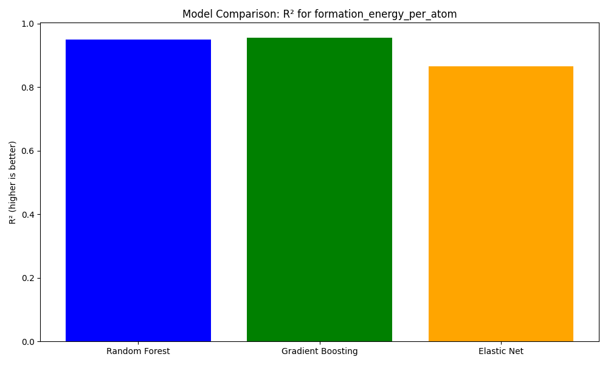

# Materials Science Machine Learning Pipeline

A comprehensive system for predicting material properties using machine learning

<div class="pt-12">
  <span class="px-2 py-1">
    Press <kbd>space</kbd> to navigate
  </span>
</div>

---
layout: two-cols
---

# Project Overview

- Data processing pipeline
- ML models for prediction
- REST API for predictions
- MongoDB integration
- Visualization tools

::right::


---
layout: default
---

# System Architecture

<div class="grid grid-cols-2 gap-2">
<div class="text-xs">

## Core Components
- MongoDB Database
  - Data storage
  - Image handling
  - Scalable

- Data Processing
  - Cleaning
  - Feature extraction
  - Validation

</div>
<div class="text-xs">

## Tech Stack
- Backend
  - Python 3.8+
  - Flask
  - MongoDB

- ML & Analysis
  - Scikit-learn
  - Pandas/NumPy
  - Matplotlib

</div>
</div>

---
layout: default
---

# Data Pipeline

<div class="grid grid-cols-2 gap-2">
<div class="text-xs">

1. **Data Collection**
   - Load from DataFed
   - Store in MongoDB
   - Handle JSON/images

2. **Preprocessing**
   - Feature engineering
   - Data cleaning
   - Train/test split

</div>
<div class="text-xs">

3. **Model Training**
   - Multiple algorithms
   - Hyperparameter tuning
   - Cross-validation

4. **Evaluation**
   - Model comparison
   - Error analysis
   - Performance metrics

</div>
</div>

---
layout: default
---

# Model Architecture

<div class="grid grid-cols-2 gap-2">
<div class="text-xs">

## Random Forest
```python
RandomForestRegressor(
    n_estimators=200,
    max_depth=20
)
```

- Ensemble method
- Feature importance
- Parallel processing

</div>
<div class="text-xs">

## Gradient Boosting
```python
GradientBoostingRegressor(
    n_estimators=500,
    learning_rate=0.1
)
```

- Sequential learning
- Strong prediction
- Feature interaction

</div>
</div>

---
layout: default
---

# Model Performance

<div class="grid grid-cols-2 gap-2">
<div>


## Performance
- R²: 0.85-0.92
- RMSE: 0.15-0.25 eV

</div>
<div>



## Cross-Validation
- 5-fold CV
- Stratified sampling
- Nested CV

</div>
</div>

---
layout: default
---

# Data Distribution

<div class="grid grid-cols-2 gap-2">
<div>


## Crystal Systems
- Cubic
- Tetragonal
- Orthorhombic

</div>
<div>


## Band Gap Range
- 0-2 eV: 40%
- 2-4 eV: 35%
- >4 eV: 25%

</div>
</div>

<div class="grid grid-cols-2 gap-2 mt-4">
<div>


## Elements
- Most common elements
- Distribution analysis
- Composition patterns

</div>
<div>


## Correlations
- Property relationships
- Feature interactions
- Statistical analysis

</div>
</div>

---
layout: default
---

# Feature Importance

<div class="grid grid-cols-2 gap-2">
<div class="text-xs">


## Key Categories
- Elemental Properties
- Crystal Structure
- Composition

</div>
<div class="text-xs">


## Top Features
- Atomic properties
- Crystal parameters
- Element ratios

</div>
</div>

<div class="grid grid-cols-2 gap-2 mt-4">
<div>


## Gradient Boosting
- Feature ranking
- Importance scores
- Model insights

</div>
<div>


## Correlations
- Feature relationships
- Interaction analysis
- Dependencies

</div>
</div>

---
layout: default
---

# Model Predictions

<div class="grid grid-cols-2 gap-2">
<div>


## Random Forest
- High accuracy
- Good generalization

</div>
<div>


## Gradient Boosting
- Best performance
- Complex patterns

</div>
</div>

<div class="grid grid-cols-2 gap-2 mt-4">
<div>


## Error Analysis
- Prediction errors
- Distribution patterns
- Outlier detection

</div>
<div>


## Error Analysis
- Error patterns
- Model behavior
- Performance insights

</div>
</div>

---
layout: default
---

# Future Work

<div class="grid grid-cols-2 gap-2">
<div class="text-xs">

## Model Enhancements
- Deep Learning models
- Transformer architectures
- Ensemble methods
- Bayesian optimization

</div>
<div class="text-xs">

## Applications
- Materials discovery
- Property prediction
- Process optimization
- Quality control

</div>
</div>

---
layout: default
---

# Project Structure

```
DSCI-592/
├── data/
│   ├── data_json/
│   └── images/
├── models/
├── plots/
├── src/
│   ├── data/
│   ├── models/
│   └── api/
├── tests/
└── docs/
```

---
layout: end
---

# Thank You!
