# GPU‑Accelerated Image Embedding & Active‑Learning Pipeline

### A deep‑dive walkthrough

Chirayu Patel · Anish Kania · Aryan Jain · Manav Bhagat
---

## Table of Contents

1. Project Overview
2. Data & Storage Strategy
3. Hardware & Environment
4. Model Architecture
5. Embedding Extraction
6. Dimensionality Reduction
7. Clustering & Classification
8. Retrieval System
9. Active‑Learning Loop
10. Results & Performance
11. Lessons Learned
12. Next Steps

---

## 1 Project Overview

* **Goal:** Build a scalable pipeline that converts raw PNG images → compact embeddings → actionable insights.
* **Scale:** \~1 million images (≃ 800 GB) across 17 target classes.
* **Key tech stack:** PyTorch, cuML, scikit‑learn, LightGBM, FAISS (future).
* **Output:**

  * Interactive visual maps (t‑SNE / UMAP / PCA)
  * Rapid image retrieval (KNN)
  * Iteratively improving classifier via active learning.

---

## 2 Data & Storage Strategy

* **Raw source:** Internal blob storage → nightly sync to `data/raw/`.
* **Pre‑process:**

  ```bash
  convert *.tiff -resize 512x512 png24:data/output/png/%04d.png
  ```
* **Metadata:** Saved to **Parquet** for fast IO (<2 s to load 1 M rows).
* **Embeddings cache:** `embeddings.lmdb` (read‑optimized; 1.4 GB).
* **Why LMDB?**

  * Zero‑copy reads
  * Memory‑mapped → low RAM footprint
  * Concurrent readers, single writer = ideal for offline batch jobs.

---

## 3 Model Architecture

```mermaid
flowchart LR
    A[Input PNG 224×224] -->|RGB| B(Conv‑7×7, 64)
    B --> C(BN + ReLU + MaxPool)
    C --> D(Residual Block × 3)
    D --> E(Residual Block × 4)
    E --> F(Residual Block × 6)
    F --> G(Residual Block × 3)
    G --> H(AvgPool + Flatten)
    H --> I[Custom FC Head]
    I -->|128‑D Embedding| J
```



**Custom FC Head**
`2048 → BN → Dropout(0.5) → 512 → ReLU → BN → Dropout → 64 → ReLU → BN → Dropout → 17‑class logits`

---

## 4 Embedding Extraction

```python
model.fc = model.fc[:-1]   # strip output layer → 64‑D
model.eval()
embeddings, paths = [], []
for batch, fns in loader:
    with torch.no_grad():
        vec = model(batch.to("cuda:4"))
    embeddings.append(vec.cpu())
    paths += fns
embeddings = torch.cat(embeddings).numpy()  # shape: (1 M, 64)
```

* **Throughput:** 9 k img/s on a single A100.
* **Bottleneck:** Disk → GPU transfer (solved with pre‑fetch queue & pinned memory).

---

## 5 Dimensionality Reduction

### a) t‑SNE (cuML)

* **Perplexity:** 30
* **Iterations:** 1 000
* **Barnes‑Hut GPU** acceleration → 8 min (vs 3 h CPU).
---

### b) UMAP (cuML)


* **n\_neighbors:** 15
* **min\_dist:** 0.1
* Completed in 90 s.
---


### c) PCA (scikit‑learn, CPU)


* Centered & whitened; used mainly for quick sanity checks.

---

## 6 Clustering

* **Algorithm:** Mini‑Batch K‑Means (k = 10) for scalability.
* **Initialization:** k‑means++ with 20 restarts.
* **Evaluation:** Silhouette score ≈ 0.43 → reasonable separation.

### Cluster Size Distribution

```csv
cluster,count
0,112 456
1,97 234
2,101 890
3,93 442
4,97 811
5,104 003
6,98 770
7,94 512
8,100 205
9,99 677
```


---


---

---
## 7 Classification

### Logistic Regression (baseline)

* **Input:** 64‑D embeddings
* **Solver:** `lbfgs`, max\_iter = 1 000
* **Accuracy:** `79.6 %` on held‑out 20 %.

### LightGBM (GPU)

```python
params = {
  'objective':'multiclass', 'num_class':10,
  'learning_rate':0.05, 'num_leaves':255,
  'feature_fraction':0.9, 'device':'gpu'
}
```

* **Best multi‑logloss:** 0.3123
* **Accuracy:** `86.2 %` (↑ 6.6 pp over baseline).

---

## 8 Anomaly Detection

* **Model:** Isolation Forest (`n_estimators` = 200).
* **Threshold:** Top 5 % most‑isolated flagged.
* **Use‑case:** Surface mislabeled or corrupted images quickly for manual review.

---

## 9 Image Retrieval

```python
import faiss
index = faiss.IndexFlatL2(64)
index.add(embeddings.astype('float32'))
D, I = index.search(query_vec.astype('float32'), k=5)
```

* **Latency:** < 5 ms per query (in‑RAM).
* **Plan:** Persist as IVF‑PQ for billion‑scale.

---

## 10 Active‑Learning Strategy

1. **Seed set:** Random 5 % labeled.
2. **Model:** LightGBM on current labeled pool.
3. **Uncertainty:** 1 – max probability (entropy also tested).
4. **Query batch:** Top 5 % most uncertain → annotate → add to pool.
5. **Stop:** Until validation accuracy plateaus.

### Pseudocode

```python
for t in range(T):
    clf.fit(X_lab, y_lab)
    probs = clf.predict_proba(X_unlab)
    uncertainty = 1 - probs.max(1)
    Q = uncertainty.argsort()[-Q_size:]
    X_lab = np.vstack([X_lab, X_unlab[Q]])
    y_lab = np.hstack([y_lab, y_unlab[Q]])
    X_unlab = np.delete(X_unlab, Q, axis=0)
```

---

## 11 Active‑Learning Results

* **Start:** 79 %
* **After 10 iterations:** 92.4 % (+13 pp).
* Labeled set grew from 5 % → 55 % (but guided by uncertainty).

---

## 12 Performance Profile

| Component             | Wall‑time    | GPU Util | Peak VRAM |
| --------------------- | ------------ | -------- | --------- |
| Embedding extraction  | **1 h 54 m** | 92 %     | 11 GB     |
| t‑SNE (cuML)          |  12 s     | 80 %     | 6 GB      |
| UMAP (cuML)           |  29 s     | 68 %     | 4 GB      |
| K‑Means (MB)          | 3 m 40 s     | 10 %     | 0.5 GB    |
| LightGBM (100 rounds) | 2 h 35 m     | 90 %      | 35 GB      |

---

## 13 Lessons Learned

* **I/O trumps FLOPs:** Proper data loader prefetch doubled throughput.
* **cuML quirks:** Ensure matching **CUDA toolkit** versions or segfaults.
* **Class imbalance:** Address via stratified sampling before clustering.
* **Active learning**: Uncertainty sampling > random but annotation cost grows; consider cost‑sensitive query.

---

## 14 Next Steps

* Hyperparameter search with **Optuna** on embeddings & LightGBM.
* Swap backbone to **DINOv2 ViT‑L**; compare self‑supervised vs supervised.
* Replace KNN with **FAISS IVF‑PQ** for sub‑ms retrieval.
* Deploy inference via **Triton** with NVIDIA A2 nodes for cost‑effective scaling.

---

## 15 Appendix A — Library Versions

```text
Python            3.10.14
PyTorch           2.2.1+cu124
cuML              24.02.00
scikit‑learn      1.5.0
LightGBM          4.3.0 (GPU)
CUDA Toolkit      12.4
FAISS             1.8.0
```


---

# Thank you 🙏

## <small>Questions & Discussion</small>
