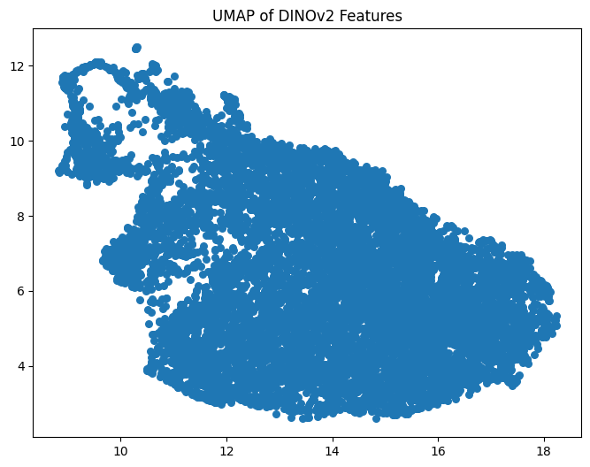
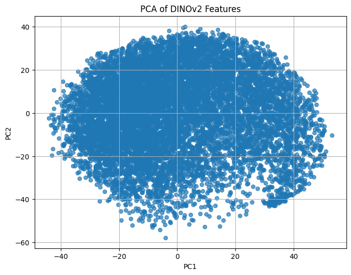
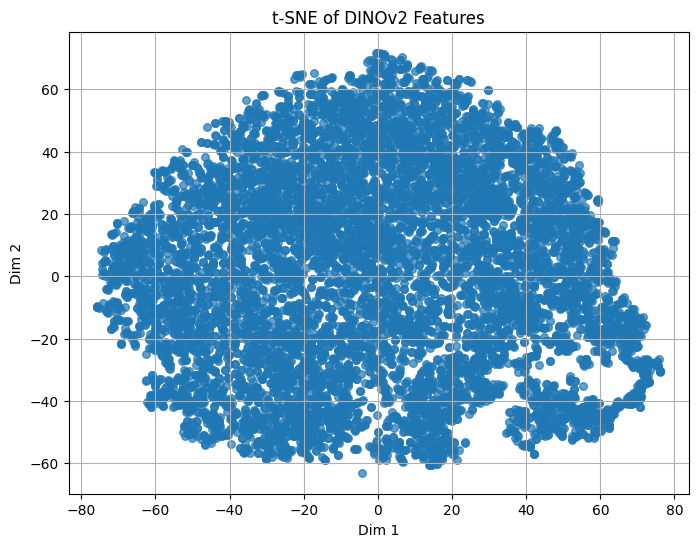
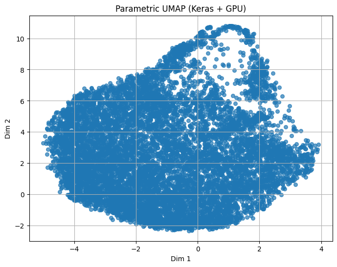
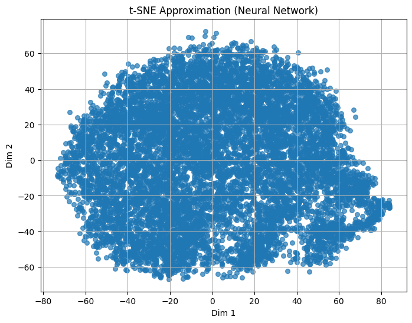

# 🔍 Exploring Image Embeddings  
### Using DINOv2, UMAP, PCA & t-SNE  
Chirayu Patel, Anish Kania, Aryan Jain and Manav Bhagat

---

# ⚙️ Setup & Model

- Using `timm` to load `ViT-small` pretrained with DINOv2
- Device: CUDA-enabled GPU (if available)
- Model scripted to TorchScript for deployment

**About the Model:**
- **DINOv2** is a self-supervised vision transformer (ViT) model trained to produce rich, general-purpose image representations without requiring labeled data.
- The **ViT-small** architecture splits each image into patches, processes them with transformer layers, and outputs a "CLS token" embedding summarizing the whole image.
- The **CLS token** is a special vector that captures global semantic information from the image, making it ideal for downstream tasks like clustering, visualization, and retrieval.
- Using a pretrained model like DINOv2 allows us to leverage powerful, transferable features even for images outside the original training set.

```python
dino_model = timm.create_model('vit_small_patch16_224.dino', pretrained=True)
dino_model.eval().to(device)
```

---

# 📦 Data Processing

- Images loaded via `OpenCV` and resized to 32x32 for uniformity
- Upsampled to 224x224 to match ViT input requirements
- Normalized using the mean and standard deviation expected by DINOv2
- Images are batched and passed through the model in groups for efficient GPU utilization
- Feature extraction from CLS token

**Details:**
- Each image is read from disk, converted to RGB, and resized to 32x32 pixels to ensure consistency across the dataset.
- Before passing to the model, images are upsampled to 224x224 pixels, as required by the ViT architecture.
- Images are normalized using the standard ImageNet mean and standard deviation, matching the DINOv2 training setup.
- Batching is used to process multiple images at once, maximizing GPU throughput and reducing inference time.
- The model outputs a feature vector for each image; specifically, the CLS token is extracted from the model's output as the image embedding.

```python
img_tensor = torch.nn.functional.interpolate(img_tensor.unsqueeze(0), ...)
features = dino_model.forward_features(batch_tensors)[:, 0]
```

---

# 📊 Feature Embeddings

- Total images: `{{ features_np.shape[0] }}`
- Feature vector shape: `(384,)`

**What are Feature Embeddings?**
- Each image is represented by a 384-dimensional feature vector (the CLS token from DINOv2 ViT-small).
- These embeddings capture high-level semantic and visual information, enabling comparison between images in a meaningful way.
- The feature vectors are used as input for dimensionality reduction techniques (UMAP, t-SNE, PCA) to visualize the structure of the dataset and discover patterns or clusters.
- Embeddings can also be used for tasks like image retrieval, clustering, anomaly detection, and more.

```python
features = extract_features_dino(images_np)
```

---

# 🧑‍🔬 DINOv2 ViT: Technical Overview

- Patch Embedding: The input image is split into fixed-size patches (e.g., 16x16), each linearly projected into a vector.
- Positional Encoding: Each patch embedding is added to a positional encoding to retain spatial information.
- Transformer Encoder: Multiple self-attention layers process the sequence of patch embeddings, allowing global context aggregation.
- CLS Token: A special learnable token is prepended to the sequence; after transformer processing, its output is used as the global image representation.
- DINOv2 Training: Uses self-distillation (teacher-student) to learn features without labels, making the embeddings highly transferable.

---

# 📉 Dimensionality Reduction: Technical Intuition

A summary of the main techniques used for visualizing and understanding high-dimensional feature embeddings:

- PCA: Projects data onto directions of maximum variance (linear, orthogonal axes).
- t-SNE: Minimizes divergence between pairwise similarities in high- and low-dimensional space; excels at preserving local structure.
- UMAP: Constructs a high-dimensional graph and optimizes a low-dimensional graph to be structurally similar; preserves both local and some global structure.
- Parametric UMAP: Learns a neural network mapping for dimensionality reduction, enabling fast inference on new data.
- t-SNE NN: Trains a neural network to approximate t-SNE, allowing scalable, parametric mapping.

---

# 📉 UMAP Visualization

<div style="overflow-x:auto">

```python
umap.UMAP(n_components=2).fit_transform(features)
```

</div>


UMAP provides a non-linear manifold projection of the features, focusing on preserving both local and some global structure. Compared to t-SNE, it often produces more interpretable layouts and can better preserve large-scale topology.

---

# 📈 PCA Visualization

- Fast linear projection
- Often used before t-SNE for speed

<div style="overflow-x:auto">

```python
PCA(n_components=2).fit_transform(features)
```

</div>


Principal Component Analysis (PCA) provides a linear projection of DINOv2 features into 2D. Although it lacks the non-linear separation of t-SNE or UMAP, it offers a quick and interpretable global structure, showing variance-driven separation.

---

# 🧠 t-SNE (Slow but Powerful)

- Perplexity: 30
- 1000 iterations

<div style="overflow-x:auto">

```python
TSNE(n_components=2).fit_transform(features_pca_50)
```

</div>


Traditional t-SNE applied to the 384-dimensional DINOv2 CLS token embeddings. This non-parametric method captures local similarities, often forming dense, spherical clusters. Ideal for understanding fine-grained visual similarities.

---

# 🤖 Parametric UMAP (Keras)

- Feedforward MLP encoder
- GPU accelerated with TensorFlow

<div style="overflow-x:auto">

```python
ParametricUMAP(encoder=keras_encoder).fit_transform(features_np)
```

</div>


Parametric UMAP uses a trainable neural network encoder (built with Keras) to learn a mapping from high-dimensional features to 2D space. Compared to standard UMAP, this method supports GPU acceleration and can generalize to new samples. The output shows a well-separated, non-linear structure learned by the model.

---

# 🧠 t-SNE Approximation

- Learned mapping from features to 2D t-SNE space
- Train simple MLP on `(features, tsne_output)`

<div style="overflow-x:auto">

```python
nn.Sequential(
  nn.Linear(384, 256), nn.ReLU(), nn.Linear(256, 2)
)
```

</div>


This plot represents a learned neural network's approximation of t-SNE embeddings. Instead of computing t-SNE (which is non-parametric and slow), a small MLP was trained to mimic the t-SNE output, allowing fast inference on new data. The structure is retained reasonably well, showcasing the potential for scalable t-SNE inference.

---

# 💾 Model Export

- Scripted feature extractor for deployment

```python
torch.jit.script(DinoFeatureExtractor(dino_model))
```

Saved to: `dino_model/1/model.pt`

---

# 📚 Summary

- ✅ Extracted features using DINOv2
- ✅ Visualized using UMAP, PCA, and t-SNE
- ✅ Trained NN to approximate t-SNE
- ✅ Created deployable TorchScript model

---

# 🙌 Thank You!

> Questions?  
Let's discuss further applications (e.g., clustering, search, anomaly detection)

---

<style>
img { max-width: 90vw; height: 1000; }
pre { max-width: 90vw; overflow-x: auto; }
</style>

